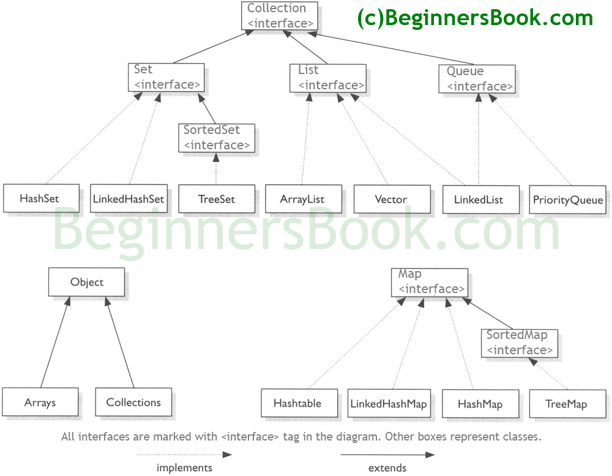

# Data Structures
Personal notes on data structure methods and definitions.

## Articles
- [Top 10 Algorithms and Data Structures for Competitive Programming](https://www.geeksforgeeks.org/top-algorithms-and-data-structures-for-competitive-programming/)
- [Collections in Java](https://www.geeksforgeeks.org/collections-in-java-2/)

## Takeaways
### Collections v Data Structures 
- A data structure is how the data is represented inside the storage in memory. A collection is how it **can** be accessed.
- The Collection interface **(java.util.Collection)** and Map interface **(java.util.Map)** are the two main “root” interfaces of Java collection classes.

## Visuals
- 
